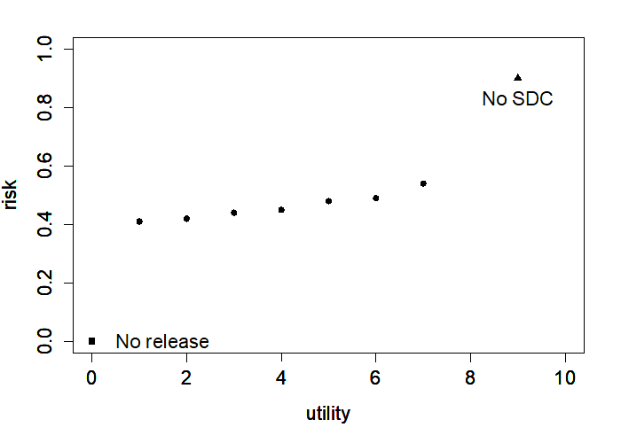

Statistical Disclosure Control (SDC): An Introduction
=====================================================

Need for SDC
--------------

A large part of the data collected by statistical agencies cannot be
published directly due to privacy and confidentiality concerns. These
concerns are both of legal and ethical nature. SDC seeks to treat and
alter the data so that the data can be published or released without
revealing the confidential information it contains, while, at the same
time, limit information loss due to the anonymization of the data. In
this guide, we discuss only disclosure control for
microdata. [#foot18]_ Microdata are datasets that provide
information on a set of variables for each individual respondent.
Respondents can be natural persons, but also legal entities such as
companies.

The aim of anonymizing microdata is to transform the datasets to achieve
an “acceptable level” of disclosure risk. The level of acceptability of
disclosure risk and the need for anonymization are usually at the
discretion of the data producer and guided by legislation. These are
formulated in the dissemination policies and programs of the data
providers and based on considerations including “[…] the costs and
expertise involved; questions of data quality, potential misuse and
misunderstanding of data by users; legal and ethical matters; and
maintaining the trust and support of respondents” (Dupriez and Boyko,
2010). There is a moral, ethical and legal obligation for the data
producers to ensure that data provided by the respondents are used only
for statistical purposes.

In some cases, the dissemination of microdata is a legal obligation,
but, in most cases, the legislation will formulate restrictions. Thus, a
country’s legislative framework will shape its microdata dissemination
policy. It is crucial for data producers to “ensure there is a sound
legal and ethical base (as well as the technical and methodological
tools) for protecting confidentiality. This legal and ethical base
requires a balanced assessment between the public good of
confidentiality protection on the one hand, and the public benefits of
research on the other. A decision on whether or not to provide access
might depend on the merits of specific research proposals and the
credibility of the researcher, and there should be some allowance for
this in the legal arrangements.” (Dupriez and Boyko, 2010).

“Data access arrangements should respect the legal rights and legitimate
interests of all stakeholders in the public research enterprise. Access
to, and use of, certain research data will necessarily be limited by
various types of legal requirements, which may include restrictions for
reasons of:

-  National security: data pertaining to intelligence, military
   activities, or political decision making may be classified and
   therefore subject to restricted access.

-  Privacy and confidentiality: data on human subjects and other
   personal data are subject to restricted access under national laws
   and policies to protect confidentiality and privacy. However,
   anonymization or confidentiality procedures that ensure a
   satisfactory level of confidentiality should be considered by
   custodians of such data to preserve as much data utility as possible
   for researchers.

-  Trade secrets and intellectual property rights: data on, or from,
   businesses or other parties that contain confidential information may
   not be accessible for research. (...)” (Dupriez and Boyko, 2010).

   Box 1, extracted from Dupriez and Boyko (2010), provides several
   examples of statistical legislation on microdata release.

Box 1: Examples of statistical legislation on microdata release

Besides the legal and ethical concerns and codes of conducts of agencies
producing statistics, SDC is important because it guarantees data
quality and response rates in future surveys. If respondents feel that
data producers are not protecting their privacy, they might not be
willing to participate in future surveys. “[…] one incident,
particularly if it receives strong media attention, could have a
significant impact on respondent cooperation and therefore on the
quality of official statistics” (ibid.). At the same time, if data users
are unable to gain enough utility from the data due to excessive or
inappropriate SDC protection, or are unable to access the data, then the
large investment in producing the data will be lost.

The risk-utility trade-off in the SDC process
-----------------------------------------------

SDC is characterized by the trade-off between risk of disclosure and
utility of the data for end users. The risk–utility scale extends
between two extremes; (i) no data is released (zero risk of disclosure)
and thus users gain no utility from the data, to (ii) data is released
without any treatment, and thus with maximum risk of disclosure, but
also maximum utility to the user (i.e., no information loss). The goal
of a well-implemented SDC process is to find the optimal point where
utility for end users is maximized at an acceptable level of risk.
Figure 2.1 illustrates this trade-off. The triangle corresponds to the
raw data. The raw data have no information loss, but generally have a
disclosure risk higher than the acceptable level. The other extreme is
the square, which corresponds to no data release. In that case there is
no disclosure risk, but also no utility from the data for the users. The
points in-between correspond to different choices of SDC methods and/or
parameters for these methods applied to different variables. The SDC
process looks for the SDC methods and the parameters for those methods
and applies these in a way that reduces the risk sufficiently, while
minimizing the information loss.

Figure 2.1: Risk-utility trade-off

SDC cannot achieve total risk elimination, but can reduce the risk to an
acceptable level. Any application of SDC methods will suppress or alter
values in the data and as such decrease the utility (i.e., result in
information loss) when compared to the original data. A common thread
that will be emphasized throughout this guide will be that the process
of SDC should prioritize the goal of protecting respondents, while at
the same time keeping the data users in mind to limit information loss.
In general, the lower the disclosure risk, the higher the information
loss and the lower the data utility for end-users.

In practice, choosing SDC methods is partially trial and error: after
applying methods, disclosure risk and data utility are re-measured and
compared to the results of other choices of methods and parameters. If
the result is satisfactory, the data can be released. We will see that
often the first attempt will not be the optimal one. The risk may not be
sufficiently reduced or the information loss may be too high and the
process has to be repeated with different methods or parameters until a
satisfactory solution is found. Disclosure risk, data utility and
information loss in the SDC context and how to measure them are
discussed in subsequent chapters of this guide.

Again, it must be stressed that the level of SDC and methods applied
depend to a large extent on the entire data release framework. For
example, a key consideration is to whom and under what conditions the
data are to be released (see also Chapter 3). If data are to be released
as public use data, then the level of SDC applied will necessarily need
to be higher than in the cases where data are released under license
conditions to trusted users after careful vetting. With careful
preparation, data may be released under both public and licensed
versions. We discuss how this might be achieved later in the guide.

Release Types
---------------

This section discusses data release. Rather than rewriting work that has
already been conducted through the World Bank and its partners at the
IHSN, this section extracts from an excellent guide published by Dupriez
and Boyko (2010).

The trade-off between risk and utility in the anonymization process
depends greatly on who the users are [#foot19]_ and under
what conditions a microdata file is released. Generally, three types of
data release methods are practiced and apply to different target groups.

-  **Public Use File (PUF)**: the data “are available to anyone agreeing
   to respect a core set of easy-to-meet conditions. Such conditions
   relate to what cannot be done with the data (e.g. the data cannot be
   sold), upon gaining access to the data. In some cases PUFs are
   disseminated with no conditions; often being made available on-line,
   [e.g. on the website of the statistical agency]. These data are made
   easily accessible because the risk of identifying individual
   respondents is considered minimal. Minimising the risk of disclosure
   involves eliminating all content that can identify respondents
   directly—for instance, names, addresses and telephone numbers. In
   addition this requires purging relevant indirect identifiers from the
   microdata file. These vary across survey designs, but
   commonly-suppressed indirect identifiers include geographical
   information below the sub-national level at which the sample is
   representative. Occasionally, certain records may be suppressed also
   from PUFs, as might variables characterised by extremely skewed
   distribution or outliers. However, in lieu of deleting entire records
   or variables from microdata files, alternative SDC methods can
   minimise the risk of disclosure while maximizing information content.
   Such methods include top-and-bottom coding, local suppression or
   using data perturbation techniques [(see Chapter 5 for an overview of
   anonymization methods)]. PUFs are typically generated from census
   data files using a sub-set [or sample] of records rather than the
   entire file and [from sample surveys, such as] household surveys.”
   (Dupriez and Boyko, 2010).

-  **Scientific Use File (SUF)** (also known as a licensed file,
   microdata under contract or research file): the “dissemination is
   restricted to users who have received authorization to access them
   after submitting a documented application and signing an agreement
   governing the data’s use. While typically licensed files are also
   anonymised to ensure the risk of identifying individuals is minimised
   when used in isolation, they may still [potentially] contain
   identifiable data if linked with other data files. Direct identifiers
   such as respondents’ names must be removed from a licensed dataset.
   The data files may, however, still contain indirect variables that
   could identify respondents by matching them to other data files such
   as voter lists, land registers or school records. When disseminating
   licensed files, the recommendation is to establish and sign an
   agreement between the data producer and external bona fide users –
   trustworthy users with legitimate need to access the data. Such an
   agreement should govern access and use of such microdata
   files [#foot20]_. Sometimes, licensing agreements are only
   entered into with users affiliated to an appropriate sponsoring
   institution. i.e., research centers, universities or development
   partners. It is further recommended that, before entering into a data
   access and use agreement, the data producer asks potential users to
   complete an application form to demonstrate the need to use a
   licensed file (instead of the PUF version, if available) for a stated
   statistical or research purpose” (Dupriez and Boyko, 2010). This also
   allows the data producer to learn which characteristics of the data
   are important for the users, which is valuable information for
   optimizing future anonymization processes.

-  **Microdata available in a controlled research data center** (also
   known as data enclave): “Some files may be offered to users under
   strict conditions in a data enclave. This is a facility [(often on
   the premises of the data provider)] equipped with computers not
   linked to the internet or an external network and from which no
   information can be downloaded via USB ports, CD-DVD or other drives.
   Data enclaves contain data that are particularly sensitive or allow
   direct or easy identification of respondents. Examples include
   complete population census datasets, enterprise surveys and certain
   health related datasets containing highly-confidential information.
   Users interested in accessing a data enclave will not necessarily
   have access to the full dataset – only to the particular data subset
   they require. They will be asked to complete an application form
   demonstrating a legitimate need to access these data to fulfill a
   stated statistical or research purpose […] The outputs generated must
   be scrutinised by way of a full disclosure review before release.
   Operating a data enclave may be expensive – it requires special
   premises and computer equipment. It also demands staff with the
   skills and time to review outputs before their removal from the data
   enclave in order to ensure there is no risk of disclosure. Such staff
   must be familiar with data analysis and be able to review the request
   process and manage file servers. Because of the substantial operating
   costs and technical skills required, some statistical agencies or
   other official data producers opt to collaborate with academic
   institutions or research centres to establish and manage data
   enclaves.”

There are other data access possibilities besides these, such as
teaching files, files for other specific purposes, remote execution or
remote access. Obviously, the required level of protection depends on
the type of release; a PUF file must be protected to a much larger
extent than a SUF file, which in turn has to be protected more than a
file which is only available in an on-site facility. Section 8.3 gives
more guidance on the choice of the release type and its implications for
the anonymization process. The same microdata set can be released in
different ways for different users, e.g., as SUF and teaching file.
Section 8.3 discusses the particular issues of multiple releases of one
dataset.

The first step for any agency that wants to release data would be
formulation of clear data dissemination policies for the release of
microdata. We will see later that deciding on the level of anonymization
needed will depend partly on knowing under what conditions the data will
be released. Access policies and conditions provide the framework for
the whole release process.

The following sections further specify the conditions under which
microdata should be provided under different release types.

Conditions for PUFs
-------------------

“Generally, data regarded as public are open to anyone with access to an
[National Statistical Office] (NSO) website. It is, however, normally
good practice to include statements defining suitable uses for and
precautions to be adopted in using the data. While these may not be
legally binding, they serve to sensitise the user. Prohibitions such as
attempts to link the data to other sources can be part of the ‘use
statement’ to which the user must agree, on-line, before the data can be
downloaded. […] Dissemination of microdata files necessarily involves
the application of rules or principles. [Box 2] below [taken from
Dupriez and Boyko (2010)] shows basic principles normally applying to
PUFs.” (Dupriez and Boyko, 2010).

Box 2: Conditions for accessing and using PUFs

Conditions for SUFs
-------------------

“For [SUFs], terms and conditions must include the basic common
principles plus some additional ones applying to the researcher’s
organisation. There are two options: firstly, data are provided to a
researcher or a team for a specific purpose; secondly, data are provided
to an organization under a blanket agreement for internal use, e.g., to
an international body or research agency. In both cases, the
researcher’s organisation must be identified, as must suitable
representatives to sign the licence” (Dupriez and Boyko, 2010).

*Access to a researcher or research team for a specific purpose*

“If data are provided for an individual research project, the research
team must be identified. This is covered by requiring interested users
to complete a formal request to access the data (a model of such a
request form is provided in Appendix 1 [in Dupriez and Boyko (2010)]).
The conditions to obtain the data (see example in Box 3) will specify
that the files will not be shared outside the organisation and that data
will be stored securely. To the possible extent, the intended use of the
data – including a list of expected outputs and the organisation’s
dissemination policy – must be identified. Access to licensed datasets
is only granted when there is a legally-registered sponsoring agency,
e.g., government ministry, university, research centre or national or
international organization” (Dupriez and Boyko, 2010).

Box 3: Conditions for accessing and using SUFs

*Blanket agreement to an organization*

“In the case of a blanket agreement, where it is agreed the data can be
used widely but securely within the receiving organisation, the licence
should ensure compliance, with a named individual formally assuming
responsibility for this. Each additional user must be made aware of the
terms and conditions that apply to data files: this can be achieved by
having to sign an affidavit. Where such an agreement exists, with
security in place, it is not necessary for users to destroy the data
after use” (Dupriez and Boyko, 2010). Appendix B provides an example of
the formulation of such an agreement.

Conditions for microdata available in a controlled research data center
-----------------------------------------------------------------------

Access to microdata in research data centers is “used for particularly
sensitive data or for more detailed data for which sufficient
anonymisation to release them outside the NSO premises is not possible.
These can be referred to also as data laboratories or research data
centres. A [research data centre] may be located at the NSO headquarters
or in major centres such as universities close to the research
community. They are used to give researchers access to complete data
files but without the risk of releasing confidential data. In a typical
[research data centre], NSO staff supervise access and use of the data;
the computers must not be able to communicate outside the [research data
centre]; and the results obtained by the researchers must be screened
for confidentiality by an NSO analyst before taken outside. A model of a
data enclave access policy is provided in Appendix 2 [in Dupriez and
Boyko (2010)], and a model of a data enclave access request form is in
Appendix 3 [in Dupriez and Boyko (2010)]” (Dupriez and Boyko, 2010).

Research data centers “have the advantage of providing access to
detailed microdata but the disadvantage of requiring researchers to work
at a different location. And they are expensive to set up and operate.
It is, however, quite likely that many countries have used on-site
researchers as a way of providing access to microdata. These researchers
are sworn in under the statistics’ acts in the same way as regular NSO
employees. This approach tends to favour researchers who live near NSO
headquarters.” (Dupriez and Boyko, 2010)

.. admonition:: Recommended Reading Material on Release Types

	Dupriez, O., & Boyko, E. (2010). *Dissemination of Microdata Files;
	Principles, Procedures and Practices.* International Household Survey
	Network (IHSN).

.. [#foot18]
   There is another strand of literature on the anonymization of tabular
   data, see e.g., Hundepool et al. (2012).

.. [#foot19]
   See Section 5 in Dupriez and Boyko (2010) as to who the users of
   microdata are and to whom microdata should be made available.

.. [#foot20]
   Appendix B provides an example of a blanket agreement.

