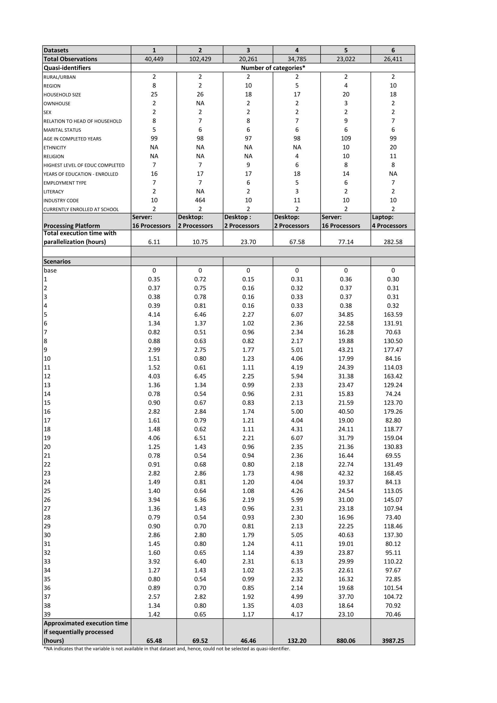
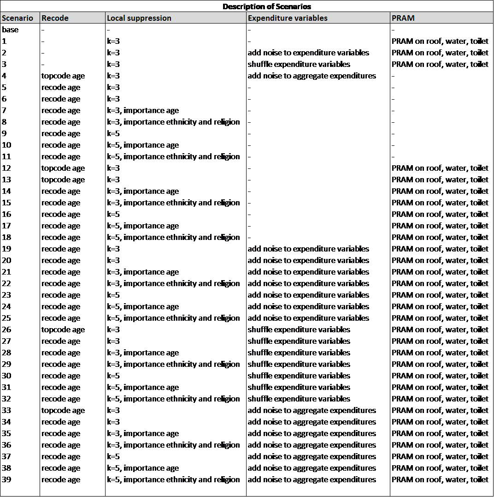

Appendices
====================================================

Appendix A: Overview of Case Study Variables
---------------------------------------------
.. table::
   :widths: auto
   :align: center
   
   ====  ================  ===================================  ======
    .     Variable          Description                          Type           
   ====  ================  ===================================  ======
    1     REGION            Region                               HH   
    2     DIST              District                             HH   
    3     URBRUR            Area of                              HH   
                            residence                                 
    4     WGTHH             Individual                           HH   
                            weighting                                 
                            coefficient                               
                            (country-specific                                       
                            weighting                                 
                            co-efficient to                           
                            derive                                    
                            individual-level                           
                            indicators)                              
    5     WGTPOP            Population                           HH   
                            weighting                                 
                            coefficient                               
                            (weighting                                
                            co-efficient                              
                            to derive                                 
                            population-level                           
                            indicators)                              
    6     IDH               Household                            HH   
                            unique                                    
                            identification                            
    7     IDP               Individual                           HH   
                            identification                            
    8     HHSIZE            Household                            HH   
                            members                                   
    9     GENDER            Sex                                  IND  
    10    REL               Relationship to                      IND  
                            household head                            
    11    MARITAL           Marital status                       IND  
    12    AGEYRS            Age in                               IND  
                            completed years                           
    13    AGEMTH            Age of child in                      IND  
                            completed                                 
                            months                                    
    14    RELIG             Religion of                          HH   
                            household head                            
    15    ETHNICITY         Ethnicity                            IND  
    16    LANGUAGE          Language                             IND  
    17    MORBID            Morbidity last                       IND  
                            x weeks                                   
    18    MEASLES           Child immunized                      IND  
                            against Measles                           
    19    MEDATT            Sought medical                       IND  
                            attention                                 
    20    CHWEIGHTKG        Weight of the                        IND  
                            child (Kg)                                
    21    CHHEIGHTCM        Height of the                        IND  
                            child (cms)                               
    22    ATSCHOOL          Current school                       IND  
                            enrolment                                 
    23    EDUCY             Highest level                        IND  
                            of education                              
                            completed                                 
    24    EDYRS             Years of                             IND  
                            education                                 
    25    EDYRSCURRAT       Years of                             IND  
                            education for                             
                            currently                                 
                            enrolled                                  
    26    SCHTYP            Type of school                       IND  
                            attending                                 
    27    LITERACY          Literacy status                      IND  
    28    EMPTYP1           Type of                              IND  
                            employment,                               
                            Primary job                               
    29    UNEMP1            Unemployed                           IND  
    30    INDUSTRY1         1 digit                              IND  
                            industry                                  
                            classification,                           
                            Primary job                               
    31    EMPCAT1           Employment                           IND  
                            categories,                               
                            Primary job                               
    32    WHOURSWEEK1       Hours worked                         IND  
                            last week,                                
                            Primary job                               
    33    OWNHOUSE          Ownership of                         HH   
                            dwelling unit                             
    34    ROOF              Main material                        HH   
                            used for roof                             
    35    TOILET            Main toilet                          HH   
                            facility                                  
    36    ELECTCON          Connection of                        HH   
                            electricity in                            
                            dwelling                                  
    37    FUELCOOK          Main cooking                         HH   
                            fuel                                      
    38    WATER             Main source of                       HH   
                            water                                     
    39    OWNAGLAND         Ownership of                         HH   
                            agricultural                              
                            land                                      
    40    LANDSIZEHA        Land size owned                      HH   
                            by household                              
                            (ha)                                      
    41    OWNMOTORCYCLE     Ownership of                         HH   
                            motorcycle                                
    42    CAR               Ownership of                         HH   
                            car                                       
    43    TV                Ownership of                         HH   
                            television                                
    44    LIVESTOCK         Number of                            HH   
                            large-sized                               
                            livestock owned                           
    45    INCRMT            Total amount of                      HH   
                            remittances                               
                            received from                             
                            remittance                                
                            sending members                           
    46    INCWAGE           Wage and                             HH   
                            salaries (annual)                           
    47    INCBONSOCALL      Bonus and                            HH   
                            social                                    
                            allowance from                            
                            wage                                      
                            job (annual)                               
    48    INCFARMBSN        Gross income                         HH   
                            from household                            
                            farm                                      
                            businesses (annual)                                       
    49    INCNFARMBSN       Gross income                         HH   
                            from household                            
                            non-farm                                  
                            businesses (annual)                                       
    50    INCRENT           Rental                               HH   
                            income (annual)                            
    51    INCFIN            Financial                            HH   
                            income from                               
                            savings, loans,                           
                            tax refunds,                              
                            maturity                                  
                            payments on                               
                            insurance                                 
    52    INCPENSN          Pension and                          HH   
                            other social                              
                            assistance (annual)                                       
    53    INCOTHER          Other                                HH   
                            income(annual)                            
    54    INCTOTGROSSHH     Total gross                          HH   
                            household                                 
                            income (annual)                            
    55    FARMEMP           Farm employment                      HH   
    56    THOUSEXP          Total                                HH   
                            expenditure on                            
                            housing                                   
    57    TFOODEXP          Total food                           HH   
                            expenditure                               
    58    TALCHEXP          Total alcohol                        HH   
                            expenditure                               
    59    TCLTHEXP          Total                                HH   
                            expenditure on                            
                            clothing and                              
                            footwear                                  
    60    TFURNEXP          Total                                HH   
                            expenditure on                            
                            furnishing                                
    61    THLTHEXP          Total                                HH   
                            expenditure on                            
                            health                                    
    62    TTRANSEXP         Total                                HH   
                            expenditure on                            
                            transport                                 
    63    TCOMMEXP          Total                                HH   
                            expenditure on                            
                            communications                            
    64    TRECEXP           Total                                HH   
                            expenditure on                            
                            recreation                                
    65    TEDUEXP           Total                                HH   
                            expenditure on                            
                            education                                 
    66    TRESTHOTEXP       Total                                HH   
                            expenditure on                            
                            restaurants and                           
                            hotel                                     
    67    TMISCEXP          Total                                HH   
                            miscellaneous                             
                            expenditure                               
    68    TANHHEXP          Total annual                         HH   
                            nominal                                   
                            household                                 
                            expenditures                              
   ====  ================  ===================================  ======

Appendix B: Example of Blanket Agreement for SUF
------------------------------------------------------------

.. figure:: media/blanketagreement.pdf
   :align: center

Source: `DuBo10`_

Appendix C: Internal and External Reports for Case Studies
-----------------------------------------------------------------------------------

This appendix provides examples of internal and external reports for the
anonymization process for the case studies in the Section 
`Case studies <case_studies.html>`__. The internal
report consists of two parts: the first is for the anonymization of the
household-level variables and the second is for the anonymization of the
individual-level variables.

Case study 1 - Internal report
~~~~~~~~~~~~~~~~~~~~~~~~~~~~~~
 to do

.. ..

   **SDC report (adapted from the report function in sdcMicro)**
   
   The dataset consists of 10,574 observations (i.e., 10,574 individuals in 2,000 households).
   
   Household-level variables
   
   Anonymization methods applied to household-level variables:
   
   - Removing households of size larger than 13 (29 households)
   - Local suppression to achieve 2-anonymity, with importance vector to prevent suppressing values of the variables HHSIZE, REGION and URBRUR
   - Recoding the variable LANDSIZEHA: rounding to one digit for values smaller than 1, rounding to zero digits for other values, grouping values 5-19 and 20-40, topcoding at 40
   - PRAMming the variables ROOF, TOILET, WATER, ELECTCON, FUELCOOK, OWNMOTORCYCLE, CAR, TV and LIVESTOCK
   - Noise addition (level 0.01 and 0.05 for outliers) to the income and expenditure components, replacing aggregates by sum of perturbed components
   
   Selected (key) variables:
   
   .. table::
      :widths: auto
      :align: center
   
      =================  ============  ============  =============  ==============  ===========
       Household level
      =================  ============  ============  =============  ==============  ===========
       categorical        URBRUR        REGION        HHSIZE         OWNAGLAND       RELIG      
       continuous         LANDSIZEHA    TANHHEXP      TFOODEXP       TALCHEXP        TCLTHEXP      
        .                 THOUSEXP      TFURNEXP      THLTHEXP       TTRANSEXP       TCOMMEXP      
        .                 TRECEXP       TEDUEXP       TRESHOTEXP     TMISCEXP        INCTOTGROSSHH      
        .                 INCRMT        INCWAGE       INCFARMBSN     INCNFARMBSN     INCRENT      
        .                 INCFIN        INCPENSN      INCOTHER      
       weight             WGTPOP      
       hhID               not defined      
       strata             not defined      
      =================  ============  ============  =============  ==============  ===========     
   
   
   - Modifications on categorical key variables: TRUE
   - Modifications on continuous key variables: TRUE
   - Modifications using PRAM: TRUE
   - Local suppressions: TRUE
   
   **Disclosure risk (household-level variables):**
   
   Frequency analysis for categorical key variables: 181
   
   Number of observations violating
   2-Anonymity: 0 (unmodified data: 103)
   
   3-Anonymity: 104 (unmodified data: 229)
   
   5-Anonymity: 374 (unmodified data: 489)
   
   Percentage of observations violating
   
   2-Anonymity: 0% (unmodified data: 5.15%)
   
   3-Anonymity: 5.28% (unmodified data: 11.45%)
   
   5-Anonymity: 18.7% (unmodified data: 24.45%)
   
   Disclosure risk categorical variables:
   
   Expected Percentage of Re-identifications: 0.05161614% (~ 1.0 observations)
   
   (unmodified data: 0.001820465% (~ 0.36 observations))
   
   10 combinations of categories with highest risk:
   
   .. table::
      :widths: auto
      :align: center
      
      =====  ========  ========  ========  ===========  =======  ====  ========
         .    URBRUR    REGION    HHSIZE    OWNAGLAND    RELIG    fk    Fk
      =====  ========  ========  ========  ===========  =======  ====  ========
       1          2         6         2          3        7        1    372.37      
       2          1         5         1          1        6        1    226.35      
       3          2         5         2          3        6        1    430.21      
       4          2         2         1          1        NA       1    173.05      
       5          2         6         1          1        5        1     80.05      
       6          1         6         1          3        5        1    343.27      
       7          2         5         1          2        NA       1    140.60     
       8          2         6         1          3        7        1    230.29      
       9          2         5         12         1        9        1    475.01      
       10         2         6         3          1        1        1    338.57
      =====  ========  ========  ========  ===========  =======  ====  ========

 
Case study 1 - External report
~~~~~~~~~~~~~~~~~~~~~~~~~~~~~~
to do
.. ..

   This case study microdata set has been treated to protect confidentiality. Several methods have been applied to protect the confidentiality: removing variables from the original dataset, removing records from the dataset, reducing detail in variables by recoding and top-coding, removing particular values of individuals at risk (local suppression) and perturbing values of certain variables.
   
   *Removing variables*
   
   The released microdata set has only a selected number of variables contained in the initial survey. Not all variables could be released in this SUF without breaching confidentiality rules.
   
   *Removing records*
   
   To protect confidentiality, records of households larger than 13 were removed. Thirty households out of a total of 2,000 households in the dataset were removed.
   Reducing detail in variables by recoding and top-coding
   The variable LANDSIZEHA was rounded to one digit for values smaller than 1, rounded to zero digits for other values, grouped for values 5-19 and 20-40 and topcoded at 40. The variable AGEYRS was recoded to ten-year age intervals for values in the age range 15 – 65.
   
   *Local suppression*
   
   Values of certain variables for particular households and individuals were deleted. In total, six values of the variable URBRUR, one of the REGION variable, 48 for the OWNAGLAND variable, 16 for the RELIG variable and 323 values of the variable REL were deleted.
   
   *Perturbing values*
   
   Uncertainty was introduced in the variables ROOF, TOILET, WATER, ELECTCON, FUELCOOK, OWNMOTORCYCLE, CAR, TV and LIVESTOCK by using the PRAM method. This method changes a certain percentage of values of variables within each variable. Here invariant PRAM was used, which guarantees that the univariate tabulations stay unchanged. Multivariate tabulations may be changed. Unfortunately, the transition matrix cannot be published.
   The income and expenditure variables were perturbed by adding noise (adding small random values to the original values). The noise added was 0.01 times the standard deviation in the original data and 0.05 for outliers. Noise was added to the components and the aggregates were recomputed to guarantee that the proportions of the different components did not change.
   
Case study 2 - Internal report
~~~~~~~~~~~~~~~~~~~~~~~~~~~~~~
to do

.. ..

   **SDC report (adapted from the report function in sdcMicro)**
   
   This report describes the anonymization measures for the PUF release additional to those already taken in the first case study. Therefore, this report should be read in conjunction with the internal report for case study 1. The original dataset consists of 10,574 observations (i.e., 10,574 individuals in 2,000 households). The dataset used for the anonymization of the PUF file is the anonymized SUF file from case study 1. This dataset consists of 10.068 observations in 1,970 households. The difference is due to the removal of large households and sensitive or identifying variables in the first case study.
   
   Household-level variables
   
   Anonymization methods applied to household-level variables:
   
   - For SUF release (see case study 1):
   	- Removing households of size larger than 13 (29 households)
   	- Local suppression to achieve 2-anonymity, with importance vector to prevent suppressing values of the variables HHSIZE, REGION and URBRUR
   - For PUF release:
   	- Remove variables OWNLANDAG, RELIG and LANDSIZEHA
   	- Local suppression to achieve 5-anonymity, with importance vector to prevent suppressing values of the variables HHSIZE and REGION
   	- PRAMming the variables ROOF, TOILET, WATER, ELECTCON, FUELCOOK, OWNMOTORCYCLE, CAR, TV and LIVESTOCK
   	- Create deciles for aggregate income and expenditure (TANNEXP and INCTOTGROSSHH) and replace the actual values with the mean of the corresponding decile. Replace income and expenditure components with the proportion of original totals.
   
   Selected (key) variables:

Case study 2 - External report
~~~~~~~~~~~~~~~~~~~~~~~~~~~~~~
to do

.. ..

   This case study microdata set has been treated to protect confidentiality. Several methods have been applied to protect the confidentiality: removing variables from the original dataset, removing records from the dataset, reducing detail in variables by recoding and top-coding, removing particular values of individuals at risk (local suppression) and perturbing values of certain variables.
   
   *Removing variables*
   
   The released microdata set has only a selected number of variables contained in the initial survey. Not all variables could be released in this PUF without breaching confidentiality rules.
   
   *Removing records*
   
   To protect confidentiality, records of households larger than 13 were removed. Twenty-nine households out of a total of 2,000 households in the dataset were removed.
   
   *Reducing detail in variables by recoding and top-coding*
   
   The variable AGEYRS was recoded to ten-year age intervals for values in the age range 15 – 65 and bottom- and top-coded at 15 and 65. The variables REL, MARITAL, EDUCY and INDUSTRY1 were recoded to less detailed categories. The total income and expenditure variables were recoded to the mean of the corresponding deciles and the income and expenditure components to the proportion of the totals.
   
   *Local suppression*
   
   Values of certain variables for particular households and individuals were deleted. In total, 67 values of the variable URBRUR, 126 of the REGION variable, 91 for the AGEYRS variable and 323 values of the variable REL were deleted.
   
   *Perturbing values*
   
   Uncertainty was introduced in the variables ROOF, TOILET, WATER, ELECTCON, FUELCOOK, OWNMOTORCYCLE, CAR, TV and LIVESTOCK by using the PRAM method. This method changes a certain percentage of values of variables within each variable. Here invariant PRAM was used, which guarantees that the univariate tabulations stay unchanged. Multivariate tabulations may be changed. Unfortunately, the transition matrix cannot be published.
..

Appendix D: Execution Times for Multiple Scenarios Tested using Selected Sample Data
-------------------------------------------------------------------------------------

   

   
   Description of anonymization scenarios

   
.. rubric:: References

.. [DuBo10] Dupriez, O., & Boyko, E. (2010). 
	**Dissemination of Microdata Files; Principles, Procedures and Practices.**
	International Household Survey Network (IHSN).
