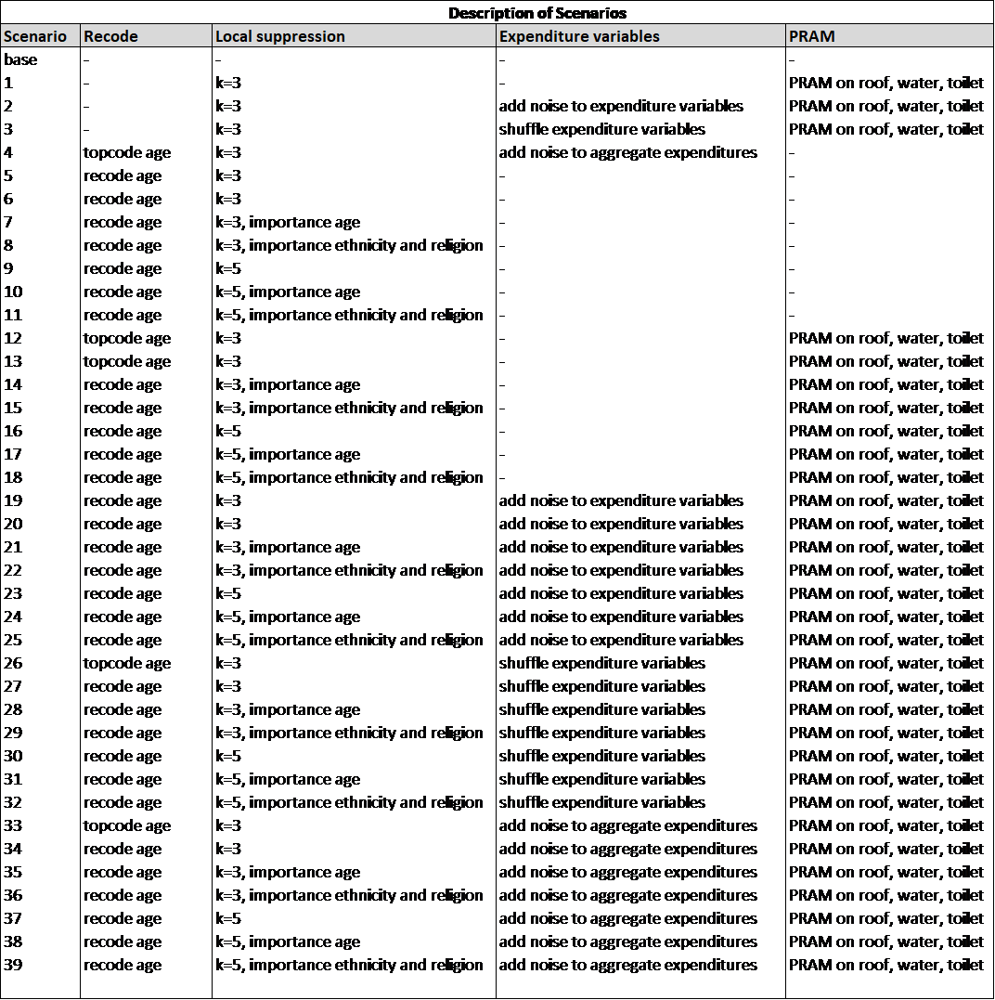

Statistical Disclosure Control for Microdata: A Practice Guide
===========================================================================

.. toctree::
   :maxdepth: 2
   :caption: Table of Content
   :numbered:
   
   intro
   glossary_acr
   SDC_intro
   release_types
   measure_risk
   anon_methods
   utility
   sdcMicro
   process
   appendices
   bibliography
   acknowledgements

     
.. toctree::
   :maxdepth: 2
   :caption: Case studies
   
   case_studies
   

